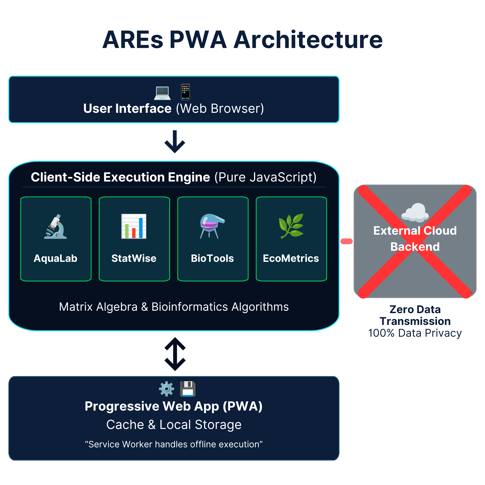

# Summary

The Aquaculture Research Ecosystem (AREs) is an open-source, browser-based
scientific computing platform designed to address the fragmented and
resource-intensive tooling landscape faced by aquaculture and fisheries
researchers. Built as a Progressive Web Application (PWA), AREs integrates
four specialized modules within a single serverless architecture: **AquaLab
Workspace** (laboratory data management and *in vivo* performance analytics),
**StatWise** (inferential statistical computing), **BioTools Suite** (molecular
bioinformatics), and **EcoMetrics Multivariat** (multivariate ecological
analysis). All computational operations — from matrix algebra to genomic
sequence alignment — execute entirely client-side in the user's web browser
using pure JavaScript, ensuring strict privacy and security of sensitive
experimental and genomic data. The platform supports full offline functionality
via Service Worker caching, making it operable in field research environments
such as coastal hatcheries and remote sampling stations where internet
connectivity is limited or absent. AREs requires no installation, server
backend, or software licensing fees, and is freely accessible at
<https://dandisw.github.io/Aquaculture-Research-Ecosystem/>.

# Statement of Need

Contemporary aquaculture and fisheries research routinely requires access to a
diverse array of specialized software tools. Statistical analyses are typically
performed in commercial platforms such as IBM SPSS or the R programming
environment; phylogenetic and sequence analyses rely on desktop tools such as
MEGA [@Kumar:2018] or server-dependent NCBI web utilities; multivariate
ecological analyses depend on PRIMER-e [@Clarke:2015] or legacy RAPFISH
implementations [@Pitcher:2001]; and laboratory data are managed through
generic spreadsheet applications. This fragmentation creates a discontinuous
research workflow wherein data must be repeatedly exported, reformatted, and
transferred between disparate applications, posing risks of data loss and
version incompatibility.

Access to professional-grade scientific software presents a particularly acute
challenge for researchers and students at institutions in low- and middle-income
countries (LMICs). Commercial licenses impose substantial financial barriers,
while open-source alternatives such as R require non-trivial competence in
programming, package management, and scripting. Web portals offering
bioinformatics or statistical utilities are entirely server-dependent, introducing
significant data privacy concerns — especially when handling unpublished genomic
sequences or proprietary experimental datasets — and rendering such tools
unusable in offline field settings.

AREs addresses these critical gaps by providing a zero-infrastructure
computational platform that unifies the four core analytical domains of
aquaculture research within a single, offline-capable, privacy-preserving, and
zero-cost web application. It is designed specifically for aquaculture and
fisheries researchers, including those working in field environments with limited
connectivity and those at institutions without access to commercial software
licenses.

# State of the Field

Several web-based scientific tools address individual domains relevant to
aquaculture research, but none integrates all of them within a single
offline-capable ecosystem.

In statistical computing, browser-based tools such as VassarStats [@Lowry:2008]
and the Real Statistics Resource Pack [@Zaiontz:2023] provide basic inferential
procedures but lack integration with biological or ecological data structures.
JASP [@Love:2019] provides a graphical interface to R but requires desktop
installation and does not function as a web application. None of these platforms
implements aquaculture-specific performance metrics or supports structured
field data entry.

In bioinformatics, NCBI provides server-dependent utilities including BLAST
[@Altschul:1990], ORFfinder, and Primer-BLAST that are widely used but require
persistent internet connectivity and offer no integration with statistical or
ecological workflows. MEGA [@Kumar:2018] is the gold standard for phylogenetic
analysis but requires desktop installation. EMBL-EBI tools such as Clustal Omega
are similarly server-dependent and not adapted for aquaculture contexts.

In multivariate ecology, PRIMER-e [@Clarke:2015] remains the standard for
community and ecological analysis but is proprietary, expensive, and desktop-only.
The original RAPFISH framework [@Pitcher:2001] was implemented as Microsoft Excel
macros no longer compatible with modern Office environments.

AREs does not attempt to replicate the full analytical breadth of these
specialized tools. Rather, it provides a curated set of the most commonly used
procedures across all four domains — validated against established reference
implementations — within a single, accessible, offline-capable platform. The
key scholarly contribution is the integration of these domains and the
architectural decision to run all computation client-side, eliminating server
dependency and data privacy risks that characterize all existing alternatives.
Researchers requiring analyses beyond AREs' scope (e.g., maximum likelihood
phylogenetics, full community ecology suites) are directed to the appropriate
specialized tools.

# Software Design

## Architectural Trade-offs

The central design decision in AREs is the commitment to a **zero-server,
client-side execution model**. This choice was made over conventional
server-side architectures for three non-negotiable reasons: data privacy
(unpublished genomic sequences and proprietary experimental data must not leave
the researcher's device), offline operability (field research environments
frequently lack stable internet access), and zero infrastructure cost (no server
to maintain, provision, or secure).

The trade-off of this decision is real and acknowledged: the platform is subject
to browser memory constraints. Very large datasets — genomic sequences exceeding
approximately 10,000 bp for multiple sequence alignment, or ecological matrices
with hundreds of variables — may cause JavaScript heap pressure. Researchers
with such workloads are advised to use purpose-built desktop tools. AREs
is designed for the most common scale of aquaculture experimental data, not
extreme-scale genomic analysis.

A second trade-off is the absence of persistent data storage between sessions.
Data entered in a session is cleared when the browser tab is closed. This is a
deliberate consequence of the privacy-first architecture: persisting data to
`localStorage` or `IndexedDB` would require additional security considerations
and user consent flows. Users are directed to use the built-in CSV export
function to save data locally between sessions.

## Progressive Web App Implementation

AREs implements the PWA specification via a Service Worker that pre-caches all
static assets on first load. On subsequent visits — including visits without
internet connectivity — all four modules load from cache with no network
requests. The Web App Manifest enables installation as a standalone desktop or
mobile application. The platform is implemented as four single-file HTML
applications (one per module), each encapsulating its own HTML, CSS, and
JavaScript. This design eliminates build toolchains, package managers, and
deployment complexity, making each module independently accessible, archivable,
and auditable.

## Algorithmic Implementation Strategy

A core design principle is that **all algorithms are implemented in vanilla ES6
JavaScript with no external computational libraries**. This decision prioritizes
long-term maintainability and security over development speed: there are no
third-party library dependencies to audit, update, or replace. The computational
correctness of each implemented algorithm was validated against reference
implementations in IBM SPSS and R CRAN prior to release.

Key algorithms implemented client-side include:

**StatWise:** The Shapiro-Wilk normality test follows Royston's (1992)
polynomial approximation [@Royston:1992]. Two-way ANOVA uses a General Linear
Model approach computing Type III Sum of Squares via Gauss-Jordan matrix
elimination on the design matrix — equivalent to SPSS UNIANOVA Type III.
Post hoc multiple comparison uses Tukey's HSD with Compact Letter Display
generated by the Piepho (2004) algorithm [@Piepho:2004]. The median-based
Levene's test [@Brown:1974] is used for variance homogeneity:

$$W = \frac{(N-k)}{(k-1)} \cdot \frac{\sum_{i=1}^{k} N_i (\bar{Z}_{i\cdot} - \bar{Z}_{\cdot\cdot})^2}{\sum_{i=1}^{k} \sum_{j=1}^{N_i} (Z_{ij} - \bar{Z}_{i\cdot})^2}$$

where $Z_{ij} = |Y_{ij} - \tilde{Y}_{i\cdot}|$ and $\tilde{Y}_{i\cdot}$ is
the group median.

**AquaLab Workspace:** Growth metrics follow @Lugert:2016. The Specific Growth
Rate (SGR) is computed as:

$$SGR = \left(\frac{\ln W_t - \ln W_0}{t}\right) \times 100$$

Free un-ionized ammonia is computed following @Emerson:1975. Biofloc carbon
supplementation follows @Avnimelech:1999.

**BioTools Suite:** Pairwise alignment uses the Smith-Waterman local alignment
algorithm [@Smith:1981]. Multiple Sequence Alignment uses a Center-Star
heuristic with Needleman-Wunsch pairwise global alignment. Phylogenetic
reconstruction uses UPGMA with Felsenstein non-parametric bootstrap
[@Felsenstein:1985]. Primer melting temperature uses nearest-neighbor
thermodynamics [@SantaLucia:1998]:

$$T_m = \frac{\Delta H^\circ}{\Delta S^\circ + R \ln C} - 273.15$$

where $\Delta H^\circ$ and $\Delta S^\circ$ are nearest-neighbor enthalpy and
entropy sums, $R$ is the gas constant, and $C$ is oligonucleotide concentration.

**EcoMetrics Multivariat:** Rapfish sustainability assessment implements
orthogonal vector projection onto the Bad–Good reference axis [@Pitcher:2001],
correcting common implementations that use linear interpolation. K-Means
clustering uses K-Means++ initialization [@Arthur:2007] to minimize degenerate
local optima. ANOSIM uses the Clarke (1993) R-statistic [@Clarke:1993] with
999-permutation significance testing. LDA solves the generalized eigenproblem
$S_W^{-1} S_B$ with ridge regularization. K-Means Elbow Method minimizes
the Within-Cluster Sum of Squares [@Jain:2010]:

$$WCSS = \sum_{j=1}^{k} \sum_{x_i \in C_j} \| x_i - \mu_j \|^2$$

# Research Impact Statement

AREs was developed to support the author's own research workflows at the Faculty
of Fisheries and Marine Sciences, Universitas Jenderal Soedirman, Indonesia, and
has been iteratively refined through active use in aquaculture experiments
spanning growth performance trials, water quality monitoring, hematological
assessment, and molecular species identification. The platform has undergone
active version-controlled public development since its initial release, with
documented iterative changelog spanning multiple major versions across all four
modules (AquaLab v5.0, StatWise v10.0, BioTools v6.0, EcoMetrics v2.0 at time
of submission).

The platform addresses a demonstrated and underserved need: no single freely
available tool provides offline-capable, integrated coverage of aquaculture
performance metrics, validated inferential statistics, molecular bioinformatics,
and multivariate ecological analysis. Statistical
outputs from StatWise have been validated against IBM SPSS Statistics and R CRAN,
demonstrating numerical parity across normality tests, ANOVA with Type III Sum of
Squares, post hoc compact letter display, and non-parametric tests with exact
p-values for small samples. This validation evidence is documented in the
repository.

The software is designed to be immediately useful to aquaculture and fisheries
researchers at LMIC institutions who lack access to commercial platforms, and to
researchers working in field environments where internet connectivity cannot be
assumed. A peer-reviewed methods manuscript describing the full platform
architecture and validation is currently in preparation.

# AI Usage Disclosure

Generative AI tools were used during development and manuscript preparation as
follows:

- **Google Gemini 2.5 Pro** (accessed via Google AI Studio, May–June 2026):
  used for initial code generation scaffolding of UI components, algorithmic
  debugging assistance, and drafting of this paper's initial text structure.
- **Anthropic Claude Sonnet 4** (accessed via Claude.ai, May–June 2026):
  used for algorithmic review and debugging, README documentation drafting,
  and manuscript refinement.

All AI-generated mathematical functions, algorithmic implementations, and paper
text were rigorously reviewed, tested, and validated against standard scientific
software outputs (IBM SPSS and R CRAN) by the author prior to implementation
and submission. All core design decisions — problem framing, architectural
choices, module scope, and validation strategy — were made by the human author.
The author takes full responsibility for the accuracy, originality, and
scientific validity of all submitted materials.

# Acknowledgements

The author acknowledges the academic environment and support provided by the
Faculty of Fisheries and Marine Sciences (FPIK), Universitas Jenderal Soedirman,
Indonesia.

# References
